# Container Diagram: Genie Team

## Diagram

```mermaid
%%{init: {"theme": "base", "themeVariables": {
  "fontFamily": "system-ui, sans-serif",
  "lineColor": "#01cdfe",
  "primaryColor": "#1f0d2e",
  "primaryTextColor": "#ffffff",
  "primaryBorderColor": "#b967ff",
  "secondaryColor": "#0f1a1e",
  "secondaryTextColor": "#01cdfe",
  "secondaryBorderColor": "#01cdfe",
  "tertiaryColor": "#0a1612",
  "tertiaryTextColor": "#05ffa1",
  "tertiaryBorderColor": "#05ffa1"
}}}%%
flowchart TB
    classDef person fill:#2d1028,stroke:#ff71ce,stroke-width:2px,color:#ff71ce
    classDef command fill:#0a2830,stroke:#01cdfe,stroke-width:2px,color:#01cdfe
    classDef genie fill:#1f0d2e,stroke:#b967ff,stroke-width:2px,color:#b967ff
    classDef agent fill:#0d1f0d,stroke:#39ff14,stroke-width:2px,color:#39ff14
    classDef skill fill:#2a2208,stroke:#ffd700,stroke-width:2px,color:#ffd700
    classDef artifact fill:#0a2418,stroke:#05ffa1,stroke-width:2px,color:#05ffa1
    classDef external fill:#1a0d24,stroke:#9d4edd,stroke-width:2px,color:#9d4edd

    subgraph users ["USERS"]
        dev["<b>Developer</b><br/> <br/><span>Invokes /commands in terminal</span><br/><span>macOS/Linux Terminal or VS Code</span>"]:::person
    end

    subgraph genie_team ["GENIE TEAM"]
        subgraph commands ["COMMANDS (commands/*.md)"]
            lifecycle["<b>Lifecycle Commands</b><br/> <br/><span>/discover /define /design<br/>/deliver /discern /done</span><br/><span>Markdown prompt definitions</span>"]:::command
            workflow["<b>Workflow Commands</b><br/> <br/><span>/feature /bugfix /spike<br/>/cleanup /commit</span><br/><span>Markdown prompt definitions</span>"]:::command
            context["<b>Context Commands</b><br/> <br/><span>/context:load /context:summary<br/>/context:recall /context:refresh</span><br/><span>Markdown prompt definitions</span>"]:::command
            brand_cmds["<b>Brand Commands</b><br/> <br/><span>/brand /brand:image<br/>/brand:tokens</span><br/><span>Markdown prompt definitions</span>"]:::command
        end

        subgraph genies ["GENIES (genies/*/)"]
            scout["<b>Scout</b><br/> <br/><span>Discovery, research, opportunity mapping</span><br/><span>PROMPT.md + TEMPLATES/</span>"]:::genie
            shaper["<b>Shaper</b><br/> <br/><span>Problem framing, appetite, constraints</span><br/><span>PROMPT.md + TEMPLATES/</span>"]:::genie
            architect["<b>Architect</b><br/> <br/><span>Technical design, ADRs, C4 diagrams</span><br/><span>PROMPT.md + TEMPLATES/</span>"]:::genie
            crafter["<b>Crafter</b><br/> <br/><span>TDD implementation, code quality</span><br/><span>PROMPT.md + TEMPLATES/</span>"]:::genie
            critic["<b>Critic</b><br/> <br/><span>Review, acceptance criteria, risks</span><br/><span>PROMPT.md + TEMPLATES/</span>"]:::genie
            tidier["<b>Tidier</b><br/> <br/><span>Refactoring, cleanup, tech debt</span><br/><span>PROMPT.md + TEMPLATES/</span>"]:::genie
            designer["<b>Designer</b><br/> <br/><span>Brand strategy, visual identity, image gen</span><br/><span>PROMPT.md + brand-spec schema</span>"]:::genie
        end

        subgraph agents_box ["AGENTS (agents/*.md)"]
            scout_agent["<b>scout</b><br/> <br/><span>Autonomous exploration subagent</span><br/><span>Task tool + Read/Glob/Grep/Web</span>"]:::agent
            architect_agent["<b>architect</b><br/> <br/><span>Design feasibility subagent</span><br/><span>Task tool + Read/Glob/Grep/Bash</span>"]:::agent
            critic_agent["<b>critic</b><br/> <br/><span>Code review subagent</span><br/><span>Task tool + Read/Glob/Grep/Bash</span>"]:::agent
            tidier_agent["<b>tidier</b><br/> <br/><span>Cleanup analysis subagent</span><br/><span>Task tool + Read/Glob/Grep/Bash</span>"]:::agent
            designer_agent["<b>designer</b><br/> <br/><span>Brand analysis subagent</span><br/><span>Task tool + Read/Glob/Grep</span>"]:::agent
        end

        subgraph skills_box ["SKILLS (.claude/skills/)"]
            tdd["<b>TDD Discipline</b><br/> <br/><span>Enforces Red-Green-Refactor cycle</span><br/><span>Auto-activates on code changes</span>"]:::skill
            quality["<b>Code Quality</b><br/> <br/><span>No hardcoding, error handling, patterns</span><br/><span>Auto-activates on implementation</span>"]:::skill
            arch_aware["<b>Architecture Awareness</b><br/> <br/><span>ADR + C4 diagram behaviors</span><br/><span>Auto-activates on /design, /define</span>"]:::skill
            brand_aware["<b>Brand Awareness</b><br/> <br/><span>Brand guide + token injection</span><br/><span>Auto-activates on /design, /deliver, /discern</span>"]:::skill
        end

        subgraph schemas_box ["SCHEMAS (schemas/*.md)"]
            schemas["<b>Document Schemas</b><br/> <br/><span>ADR, Spec, Architecture Diagram<br/>frontmatter contracts</span><br/><span>YAML + Markdown templates</span>"]:::artifact
        end

        installer["<b>install.sh</b><br/> <br/><span>Copies artifacts to .claude/ dirs</span><br/><span>Bash 4.0+ (macOS/Linux)</span>"]:::command
    end

    subgraph artifacts ["DOCUMENT TRAIL (target project)"]
        docs["<b>docs/</b><br/> <br/><span>backlog/, decisions/, architecture/,<br/>archive/, analysis/</span><br/><span>Markdown files in Git</span>"]:::artifact
    end

    subgraph external ["EXTERNAL"]
        claude_code["<b>Claude Code CLI</b><br/> <br/><span>Loads .claude/ at startup</span><br/><span>Node.js 20+ CLI (Anthropic)</span>"]:::external
        anthropic_api["<b>Anthropic API</b><br/> <br/><span>Claude 3.5 Sonnet / Opus inference</span><br/><span>HTTPS REST (api.anthropic.com)</span>"]:::external
        imagegen_mcp["<b>Image Gen MCP</b><br/> <br/><span>@fastmcp-me/imagegen-mcp</span><br/><span>Gemini 2.5 Flash / 3 Pro</span>"]:::external
    end

    dev -->|"types /command"| commands
    commands -->|"activates"| genies
    genies -->|"spawns via Task tool"| agents_box
    genies -->|"validates against"| schemas
    skills_box -.->|"auto-triggers during"| genies
    genies -->|"writes artifacts to"| docs
    installer -->|"copies to .claude/"| claude_code
    claude_code -->|"executes commands from"| commands
    agents_box -->|"runs within"| claude_code
    claude_code -->|"calls"| anthropic_api
    brand_cmds -->|"activates"| designer
    designer -->|"generates via"| imagegen_mcp
    brand_aware -.->|"injects brand context into"| architect
    brand_aware -.->|"injects brand context into"| crafter
    brand_aware -.->|"injects brand context into"| critic
```

## Coupling Notes

### Runtime Dependencies
- Commands activate Genies; Genies may spawn Agents via Claude Code's Task tool
- Skills auto-trigger based on context keywords (e.g., "test" triggers TDD Discipline)
- All execution happens within Claude Code CLI process on developer machine
- Agents run as isolated subprocesses with forked conversation context
- Brand Commands (`/brand:image`) invoke `@fastmcp-me/imagegen-mcp` MCP server for Gemini image generation (optional — degrades gracefully to prompt-only)
- Brand Awareness skill injects brand context into Architect, Crafter, and Critic (opt-in — silent no-op when no brand guide exists)

### Build-time Dependencies
- `install.sh` copies from `commands/`, `agents/`, `genies/` to target `.claude/` directories
- No compilation step — all containers are markdown/YAML prompt definitions
- Schemas define document structure but have no runtime coupling

### Data Dependencies
- Document trail persists in target project's `docs/` directory under Git version control
- Backlog items flow through lifecycle: shaped → designed → implemented → reviewed → archived
- ADRs and C4 diagrams provide architectural context read by all genies
- Specs define acceptance criteria consumed by Crafter and Critic

## Container Responsibilities

| Container | Source Location | Primary Responsibility | Key Outputs |
|-----------|-----------------|----------------------|-------------|
| **Lifecycle Commands** | `commands/*.md` | Orchestrate the 7 D's workflow | Route to appropriate genie |
| **Workflow Commands** | `commands/*.md` | Composite workflows (feature, bugfix) | Chain multiple lifecycle phases |
| **Context Commands** | `commands/*.md` | Session management | Load/save/recall project state |
| **Scout** | `genies/scout/` | Discovery and research | Opportunity Snapshots |
| **Shaper** | `genies/shaper/` | Problem framing with appetite | Shaped Contracts |
| **Architect** | `genies/architect/` | Technical design | Design Documents, ADRs, C4 diagrams |
| **Crafter** | `genies/crafter/` | TDD implementation | Working code with tests |
| **Critic** | `genies/critic/` | Review and validation | Review verdicts (APPROVED/BLOCKED) |
| **Tidier** | `genies/tidier/` | Refactoring and cleanup | Cleanup Reports, tidied code |
| **Designer** | `genies/designer/` | Brand strategy and visual identity | Brand Guides, Design Tokens, Generated Images |
| **Agents** | `agents/*.md` | Autonomous exploration | Structured findings for orchestrator |
| **Skills** | `.claude/skills/` | Automatic behavior enforcement | Inline guidance and constraints |
| **Schemas** | `schemas/*.md` | Document structure contracts | Validation rules for artifacts |
| **Brand Commands** | `commands/brand*.md` | Brand creation, image gen, token extraction | Brand guides, images, tokens |
| **Brand Awareness** | `.claude/skills/brand-awareness/` | Cross-cutting brand context injection | Inline brand constraints for other genies |
| **Image Gen MCP** | `@fastmcp-me/imagegen-mcp` | External image generation service | Generated PNG/JPG images |
| **Installer** | `install.sh` | Distribution to target projects | Populated `.claude/` directories |
