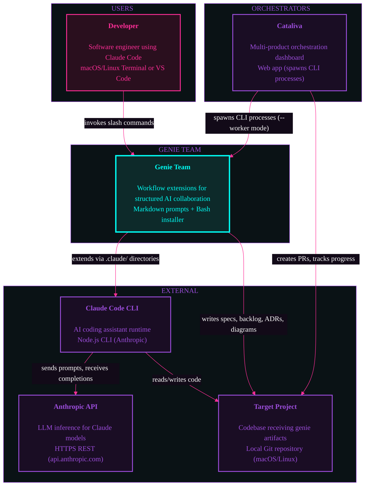

# System Context: Genie Team

## Diagram



## Coupling Notes

### Runtime Dependencies
- Genie Team requires Claude Code CLI as the execution environment
- Claude Code CLI requires Anthropic API for LLM inference
- All genie commands execute within Claude Code's conversation context
- Cataliva (optional) spawns CLI processes for multi-product orchestration

### Build-time Dependencies
- `install.sh` copies commands, skills, rules, and agents to `.claude/` directories
- No compilation — all artifacts are markdown prompt templates

### Data Dependencies
- Document trail (specs, backlog, ADRs, diagrams) persists in target project's `docs/` directory
- Claude Code manages ephemeral conversation context and tool state
- Target project's git repository provides version control for all artifacts

### Orchestration (Cataliva)

Per ADR-001 (Thin Orchestrator architecture):
- Cataliva treats genie-team CLI as a black box
- Spawns CLI processes with `--worker` flag for repository operations
- Captures stdout/stderr for progress streaming
- No shared runtime state between orchestrator and genies

```
Cataliva → spawns → genie-team --worker → operates on → Repository
    ↑                     ↓
    └── streams stdout ←──┘
```
