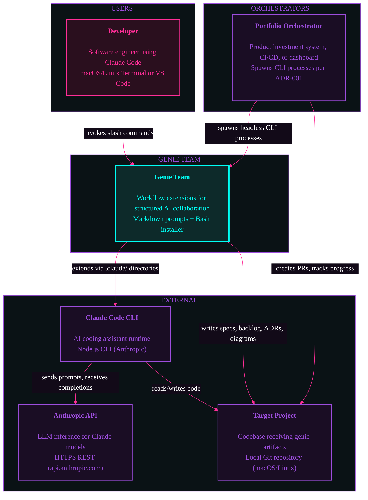

# System Context: Genie Team

## Diagram



## Coupling Notes

### Runtime Dependencies
- Genie Team requires Claude Code CLI as the execution environment
- Claude Code CLI requires Anthropic API for LLM inference
- All genie commands execute within Claude Code's conversation context
- External orchestrators (optional) spawn CLI processes for autonomous execution

### Build-time Dependencies
- `install.sh` copies commands, skills, rules, and agents to `.claude/` directories
- No compilation — all artifacts are markdown prompt templates

### Data Dependencies
- Document trail (specs, backlog, ADRs, diagrams) persists in target project's `docs/` directory
- Claude Code manages ephemeral conversation context and tool state
- Target project's git repository provides version control for all artifacts

### External Orchestration

Per ADR-001 (Thin Orchestrator architecture):
- Orchestrators treat genie-team CLI as a black box
- Spawn CLI processes via `claude -p` with `--output-format json` or `stream-json`
- Parse structured output for progress monitoring and artifact detection
- No shared runtime state between orchestrator and genies
- See `docs/architecture/cli-contract.md` for the full integration contract

```
Orchestrator → spawns → claude -p "/deliver ..." → operates on → Repository
     ↑                        ↓
     └── JSON/stream output ←─┘
```
