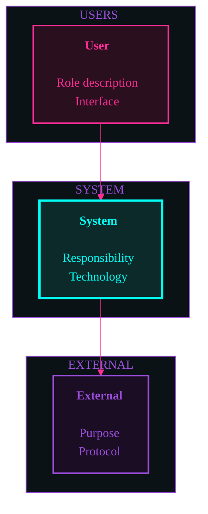
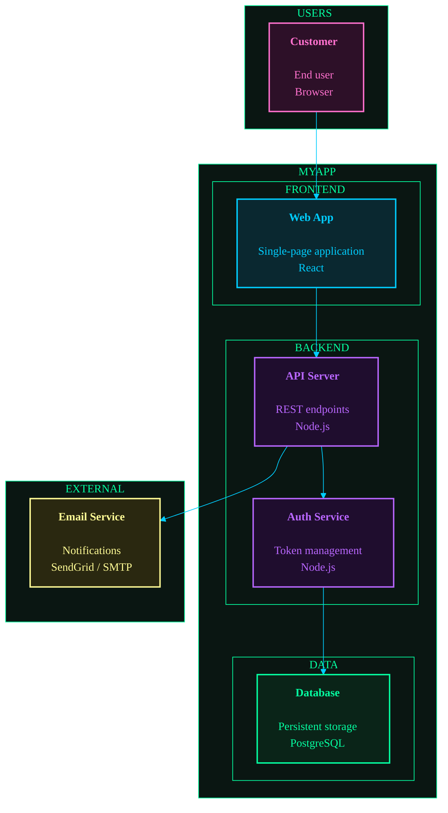

# Architecture Diagram Schema v2.0

> All structured data lives in YAML frontmatter. The markdown body contains
> Mermaid flowchart diagrams styled with neon colors and human-written architecture notes.
> Machines parse frontmatter only; the body is for humans and Mermaid renderers.

## Required Frontmatter Fields

| Field | Type | Constraint | Description |
|-------|------|------------|-------------|
| `diagram_version` | string | semver, e.g. `"1.0"` | Schema version for compatibility |
| `type` | string | `"architecture-diagram"` | Document type discriminator |
| `level` | integer | enum: `1`, `2`, `3` | C4 level (1=System Context, 2=Container, 3=Component) |
| `title` | string | max 100 chars | Human-readable diagram title |
| `updated` | string | ISO 8601 date, e.g. `"2026-01-28"` | Date of last update |
| `updated_by` | string | Command that last updated, e.g. `"/design"`, `"/arch:init"` | Provenance tracking |

## Optional Frontmatter Fields

| Field | Type | Description |
|-------|------|-------------|
| `domain` | string | Product domain (Level 3 only, matches `docs/specs/{domain}/`) |
| `backlog_ref` | string | Path to the backlog item that last updated this diagram |
| `adr_refs` | array of strings | ADR ids that established boundaries in this diagram |
| `tags` | array of strings | Categorization tags |

## C4 Level Definitions

| Level | File | Scope | Created By |
|-------|------|-------|------------|
| 1 — System Context | `docs/architecture/system-context.md` | System and external actors | `/arch:init` or `/design` |
| 2 — Container | `docs/architecture/containers.md` | High-level containers/services | `/arch:init` or `/design` |
| 3 — Component | `docs/architecture/components/{domain}.md` | Per-domain components | `/design` |

Level 4 (Code) is NOT supported. Source code is the code-level diagram.

## Directory Structure

```
docs/architecture/
  system-context.md          # Level 1
  containers.md              # Level 2
  components/                # Level 3
    {domain}.md              # One per domain, parallels docs/specs/{domain}/
```

## Neon Dark Style

All diagrams use the **Neon Dark** flowchart style with infrastructure context subgraphs.

### Color Palette

| Role | Stroke | Fill | Hex Pair |
|------|--------|------|----------|
| Actor/Person | Hot Pink | Dark Rose | `#ff2e97` / `#2a0f1e` |
| System Core | Cyan | Deep Teal | `#00fff5` / `#0d2a2a` |
| Commands/APIs | Sky Blue | Dark Teal | `#01cdfe` / `#0a2830` |
| Services/Agents | Purple | Grape | `#b967ff` / `#1f0d2e` |
| External | Violet | Dark Purple | `#9d4edd` / `#1a0d24` |
| Output/Success | Neon Green | Forest | `#39ff14` / `#0d1f0d` |
| Data/Storage | Mint | Dark Green | `#05ffa1` / `#0a2418` |
| Warning/Input | Coral | Burgundy | `#ff3864` / `#24101a` |
| Artifact | Gold | Amber | `#ffd700` / `#2a2208` |

### Node Format

Each node includes bold title with padding, responsibility, and tech stack:

```
["<b>Title</b><br/> <br/><span>Responsibility description</span><br/><span>Technology stack</span>"]
```

### Infrastructure Contexts (Subgraphs)

Use subgraphs to show runtime/deployment boundaries:

| Context | Description |
|---------|-------------|
| USERS | External actors interacting with the system |
| SYSTEM NAME | Main system boundary |
| FRONTEND | Client-side containers |
| BACKEND | Server-side containers |
| DATA | Databases and storage |
| EXTERNAL | Third-party APIs and services |

## Markdown Body Structure

Each diagram file contains:

1. **Title heading** — `# {Level Name}: {Title}`
2. **Mermaid flowchart diagram** — in a fenced code block with neon styling
3. **Coupling Notes section** — documents runtime, build-time, and data dependencies
4. **Cohesion Assessment section** — rates domain cohesion (Level 3 only)

### Body Template

````markdown
# {Level Name}: {Title}

## Diagram



## Coupling Notes

### Runtime Dependencies
- {Component A} depends on {Component B} for {reason}

### Build-time Dependencies
- {dependency description}

### Data Dependencies
- {shared data description}

## Cohesion Assessment

**Rating:** HIGH | MEDIUM | LOW
**Justification:** {Why this rating}
````

### Level 1 (System Context) Theme

```mermaid
%%{init: {"theme": "base", "themeVariables": {
  "fontFamily": "system-ui, sans-serif",
  "lineColor": "#ff2e97",
  "primaryColor": "#0d2a2a",
  "primaryTextColor": "#ffffff",
  "primaryBorderColor": "#00fff5",
  "secondaryColor": "#120a18",
  "secondaryTextColor": "#ff2e97",
  "secondaryBorderColor": "#ff2e97",
  "tertiaryColor": "#0a1215",
  "tertiaryTextColor": "#9d4edd",
  "tertiaryBorderColor": "#9d4edd"
}}}%%
```

### Level 2 (Container) Theme

```mermaid
%%{init: {"theme": "base", "themeVariables": {
  "fontFamily": "system-ui, sans-serif",
  "lineColor": "#01cdfe",
  "primaryColor": "#1f0d2e",
  "primaryTextColor": "#ffffff",
  "primaryBorderColor": "#b967ff",
  "secondaryColor": "#0f1a1e",
  "secondaryTextColor": "#01cdfe",
  "secondaryBorderColor": "#01cdfe",
  "tertiaryColor": "#0a1612",
  "tertiaryTextColor": "#05ffa1",
  "tertiaryBorderColor": "#05ffa1"
}}}%%
```

### Level 3 (Component) Theme

```mermaid
%%{init: {"theme": "base", "themeVariables": {
  "fontFamily": "system-ui, sans-serif",
  "lineColor": "#39ff14",
  "primaryColor": "#0d1f0d",
  "primaryTextColor": "#39ff14",
  "primaryBorderColor": "#39ff14",
  "secondaryColor": "#0d120d",
  "secondaryTextColor": "#39ff14",
  "secondaryBorderColor": "#39ff14",
  "tertiaryColor": "#180d12",
  "tertiaryTextColor": "#ff3864",
  "tertiaryBorderColor": "#ff3864"
}}}%%
```

## Complete Example (Level 2 — Container)

```yaml
---
diagram_version: "2.0"
type: architecture-diagram
level: 2
title: "Container Diagram"
updated: 2026-01-28
updated_by: "/arch:init"
backlog_ref: docs/backlog/P2-auth-improvements.md
adr_refs: [ADR-001]
tags: [overview]
---
```

````markdown
# Container Diagram: MyApp

## Diagram



## Coupling Notes

### Runtime Dependencies
- Web App depends on API Server (all data flows through API)
- API Server depends on Auth Service (token validation on every request)
- Auth Service depends on Database (refresh token storage)

### Build-time Dependencies
- Web App and API share TypeScript types via shared package

### Data Dependencies
- Database owned by Auth Service for session data, by API for application data
````

## Validation

To validate an architecture diagram, parse the YAML frontmatter with any
standard library and check:

1. All required fields are present
2. `type` equals `"architecture-diagram"`
3. `level` is 1, 2, or 3
4. `updated` is a valid ISO 8601 date
5. `updated_by` is present and non-empty
6. If `level` is 3, `domain` should be present (warn if missing)
7. If `adr_refs` is present, each entry matches `/^ADR-\d{3}$/`
