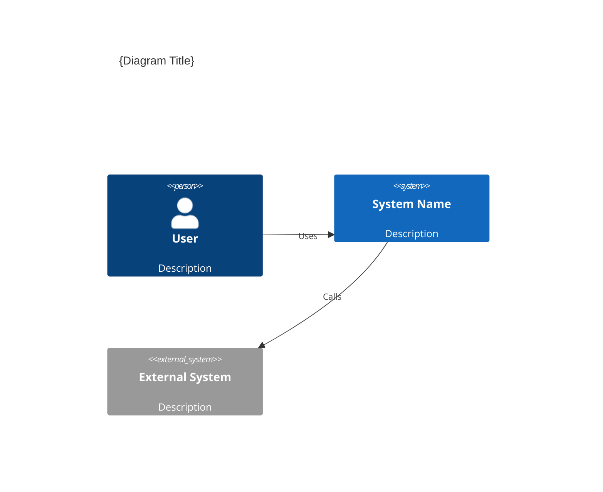
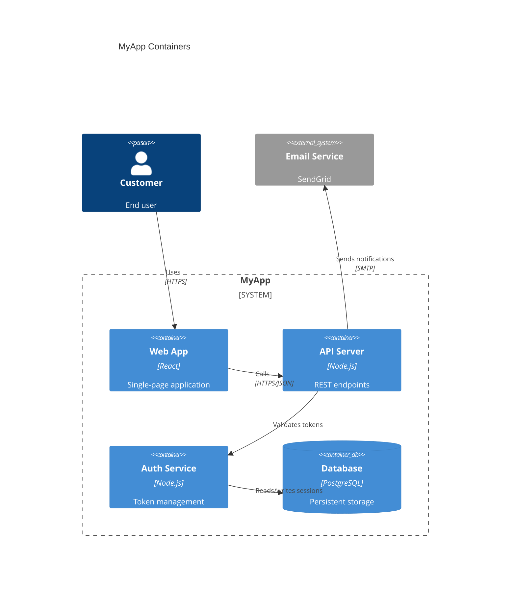

# Architecture Diagram Schema v1.0

> All structured data lives in YAML frontmatter. The markdown body contains
> Mermaid C4 diagrams and human-written architecture notes. Machines parse
> frontmatter only; the body is for humans and Mermaid renderers.

## Required Frontmatter Fields

| Field | Type | Constraint | Description |
|-------|------|------------|-------------|
| `diagram_version` | string | semver, e.g. `"1.0"` | Schema version for compatibility |
| `type` | string | `"architecture-diagram"` | Document type discriminator |
| `level` | integer | enum: `1`, `2`, `3` | C4 level (1=System Context, 2=Container, 3=Component) |
| `title` | string | max 100 chars | Human-readable diagram title |
| `updated` | string | ISO 8601 date, e.g. `"2026-01-27"` | Date of last update |
| `updated_by` | string | Command that last updated, e.g. `"/design"`, `"/spec:init"` | Provenance tracking |

## Optional Frontmatter Fields

| Field | Type | Description |
|-------|------|-------------|
| `domain` | string | Product domain (Level 3 only, matches `specs/{domain}/`) |
| `backlog_ref` | string | Path to the backlog item that last updated this diagram |
| `adr_refs` | array of strings | ADR ids that established boundaries in this diagram |
| `tags` | array of strings | Categorization tags |

## C4 Level Definitions

| Level | File | Scope | Created By |
|-------|------|-------|------------|
| 1 — System Context | `docs/architecture/system-context.md` | System and external actors | `/spec:init` or `/design` |
| 2 — Container | `docs/architecture/containers.md` | High-level containers/services | `/spec:init` or `/design` |
| 3 — Component | `docs/architecture/components/{domain}.md` | Per-domain components | `/design` |

Level 4 (Code) is NOT supported. Source code is the code-level diagram.

## Directory Structure

```
docs/architecture/
  system-context.md          # Level 1
  containers.md              # Level 2
  components/                # Level 3
    {domain}.md              # One per domain, parallels specs/{domain}/
```

## Markdown Body Structure

Each diagram file contains:

1. **Title heading** — `# {Level Name}: {Title}`
2. **Mermaid C4 diagram** — in a fenced code block using C4 extension syntax
3. **Coupling Notes section** — documents runtime, build-time, and data dependencies
4. **Cohesion Assessment section** — rates domain cohesion (Level 3 only)

### Body Template

````markdown
# {Level Name}: {Title}

## Diagram



## Coupling Notes

### Runtime Dependencies
- {Component A} depends on {Component B} for {reason}

### Build-time Dependencies
- {dependency description}

### Data Dependencies
- {shared data description}

## Cohesion Assessment

**Rating:** HIGH | MEDIUM | LOW
**Justification:** {Why this rating}
````

### Mermaid C4 Syntax Reference

Level 1 (System Context):
```
C4Context
    title System Context
    Person(alias, "Label", "Description")
    System(alias, "Label", "Description")
    System_Ext(alias, "Label", "Description")
    Rel(from, to, "Label")
```

Level 2 (Container):
```
C4Container
    title Container Diagram
    Container(alias, "Label", "Technology", "Description")
    ContainerDb(alias, "Label", "Technology", "Description")
    Container_Ext(alias, "Label", "Technology", "Description")
    Rel(from, to, "Label", "Protocol")
```

Level 3 (Component):
```
C4Component
    title Component Diagram - {Domain}
    Component(alias, "Label", "Technology", "Description")
    Component_Ext(alias, "Label", "Technology", "Description")
    Rel(from, to, "Label")
```

## Complete Example (Level 2 — Container)

```yaml
---
diagram_version: "1.0"
type: architecture-diagram
level: 2
title: "Container Diagram"
updated: 2026-01-27
updated_by: "/spec:init"
backlog_ref: docs/backlog/P2-auth-improvements.md
adr_refs: [ADR-001]
tags: [overview]
---
```

````markdown
# Container Diagram: MyApp

## Diagram



## Coupling Notes

### Runtime Dependencies
- Web App depends on API Server (all data flows through API)
- API Server depends on Auth Service (token validation on every request)
- Auth Service depends on Database (refresh token storage)

### Build-time Dependencies
- Web App and API share TypeScript types via shared package

### Data Dependencies
- Database owned by Auth Service for session data, by API for application data
````

## Validation

To validate an architecture diagram, parse the YAML frontmatter with any
standard library and check:

1. All required fields are present
2. `type` equals `"architecture-diagram"`
3. `level` is 1, 2, or 3
4. `updated` is a valid ISO 8601 date
5. `updated_by` is present and non-empty
6. If `level` is 3, `domain` should be present (warn if missing)
7. If `adr_refs` is present, each entry matches `/^ADR-\d{3}$/`
